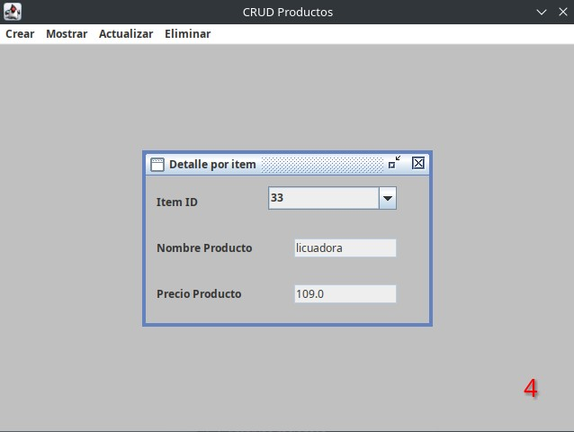
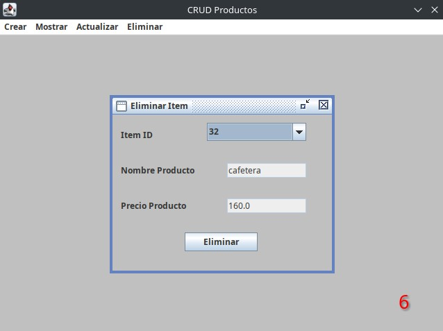

# CRUD en SWING JAVA

Un CRUD completo utilizando JAVA SWING & SQLITE (incluye la BD)

Este ejemplo prático implemento:

- Una JFrame principal que engloba toda las funciones
- Un JInternalFrame para cada una de las acciones
- Organización del código utilizando el patron de diseño MVC
- How to document API with Swagger-UI and OpenApi 3.0.0.

More about Oat++:

- [Indicación en la contru](https://oatpp.io/)
- [Oat++ Github Repository](https://github.com/oatpp/oatpp)
- [Get Started](https://oatpp.io/docs/start)

## R

Herramientas utilizadas:

- [SQlite](https://github.com/oatpp/oatpp)
- [Eclipse 2024-09](https://github.com/oatpp/oatpp-swagger)
- [DB Broswser](https://github.com/oatpp/oatpp-sqlite)

### Estructura del proyecto

```
|- CMakeLists.txt                        // projects CMakeLists.txt
|- sql/                                  // SQL migration scripts for SQLite database
|- src/
|   |
|   |- controller/                       // Folder containing REST Controllers (UserController)
|   |- db/                               // Folder containing the database client
|   |- dto/                              // DTOs are declared here
|   |- service/                          // Service business logic classes (UserService)
|   |- AppComponent.hpp                  // Service config
|   |- DatabaseComponent.hpp             // Database config
|   |- SwaggerComponent.hpp              // Swagger-UI config
|   |- App.cpp                           // main() is here
|
|- test/                                 // test folder
|- utility/install-oatpp-modules.sh      // utility script to install required oatpp-modules.
```

---

### Build and Run

#### Using CMake

##### Pre Requirements

- `oatpp` 
- `oatpp-swagger`
- `oatpp-sqlite` with `-DOATPP_SQLITE_AMALGAMATION=ON` cmake flag.

**Note:** You may run `utility/install-oatpp-modules.sh` script to install required oatpp modules.

##### Build Project

```
$ mkdir build && cd build
$ cmake ..
$ make 
$ ./crud-exe        # - run application.
```

#### In Docker

```
$ docker build -t example-crud .
$ docker run -p 8000:8000 -t example-crud
```

---

#### Imagenes

|HTTP Method|URL|Description|
|---|---|---|
||| |
||| |
